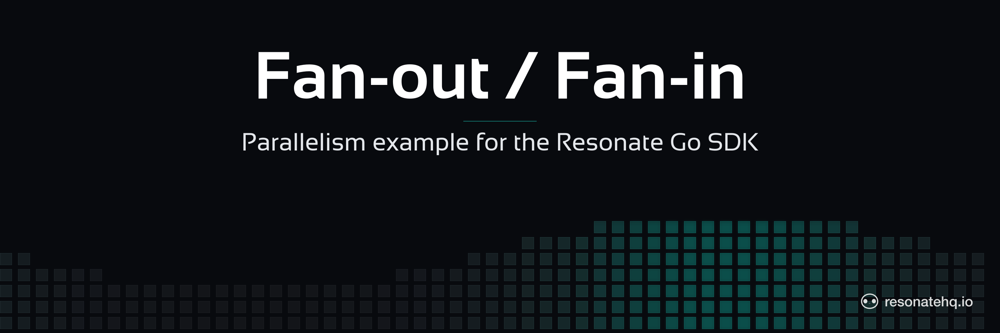

<p align="center">
  <picture>
    <source media="(prefers-color-scheme: dark)" srcset="./assets/banner-dark.png">
    <source media="(prefers-color-scheme: light)" srcset="./assets/banner-light.png">
    
  </picture>
</p>

<p align="center">
  <a href="https://resonatehq.github.io/examples-ci/">
    
  </a>
</p>

# Fan-out / Fan-in | Resonate Go SDK

Dispatch one message to N parallel notification channels and await every delivery. Each child invocation is a durable promise, so a worker crash mid-delivery doesn't lose work — restarting picks up at the unresolved children.

> Heads up — `resonate-sdk-go` is pre-release. The SDK has no semver tag yet, so this example pins to a specific commit. Expect API changes until `v0.1.0`.

## What this demonstrates

- **Fan-out** — the orchestrator dispatches N `ctx.RPC` calls in a loop, collecting their futures.
- **Fan-in** — a second loop awaits every future. Children execute concurrently in separate goroutines on each subscribed worker; the orchestrator just blocks on each result.
- **Per-child durability** — because each delivery is its own promise, a failed delivery can be inspected on the dashboard and re-triggered independently (manually or by a retry policy on the registered function).

## The code

```go
func fanout(ctx *resonate.Context, args FanoutArgs) (FanoutResult, error) {
    // Fan-out: dispatch every child first, without awaiting any.
    futures := make([]*resonate.Future, 0, len(args.Channels))
    for _, ch := range args.Channels {
        f, err := ctx.RPC("send", SendArgs{Channel: ch, Message: args.Message})
        if err != nil {
            return FanoutResult{}, err
        }
        futures = append(futures, f)
    }

    // Fan-in: now await each one. Children run concurrently on the server side.
    out := FanoutResult{Delivered: make([]Delivery, 0, len(futures))}
    for i, f := range futures {
        var d Delivery
        if err := f.Await(&d); err != nil {
            out.Delivered = append(out.Delivered, Delivery{
                Channel: args.Channels[i], OK: false, Reason: err.Error(),
            })
            continue
        }
        out.Delivered = append(out.Delivered, d)
    }
    return out, nil
}
```

The two-loop pattern is what makes the children concurrent. Collapse them into one loop (`for _, ch := range args.Channels { f, _ := ctx.RPC(...); f.Await(&d) }`) and you serialize them.

## Prerequisites

- Go 1.22+
- The `resonate` server CLI. Install with Homebrew on macOS or Linux:
  ```
  brew install resonatehq/tap/resonate
  ```
  Other install paths: <https://docs.resonatehq.io/get-started/install>.

## Setup

```sh
git clone https://github.com/resonatehq-examples/example-fan-out-fan-in-go.git
cd example-fan-out-fan-in-go
go mod download
```

## Run it

In one terminal, start the dev server:

```sh
resonate dev
```

In another:

```sh
go run .
# or with custom channels
go run . -channels=email,sms,slack,push,webhook -message="ship it"
```

Flags:

| Flag       | Default                        | Meaning                          |
|------------|--------------------------------|----------------------------------|
| `-channels`| `email,sms,slack,push`         | comma-separated channel names    |
| `-message` | `"Hello from Resonate"`        | message to deliver               |
| `-id`      | `fanout-1`                     | promise ID for the root workflow |

### Idempotency demo

The `-id` flag defaults to a fixed value (`fanout-1`). Run the program twice without changing the ID:

```sh
go run .        # executes the workflow, prints delivery results
go run .        # same ID → promise already resolved; returns the cached result instantly
```

The second run skips all the child dispatches and returns the stored result. Change `-id` to start a fresh execution:

```sh
go run . -id=fanout-2
```

## What to look for

```
[fanout] starting workflow id=fanout-1 channels=[email sms slack push]
  [send] push     <- "Hello from Resonate"
  [send] email    <- "Hello from Resonate"
  [send] slack    <- "Hello from Resonate"
  [send] sms      <- "Hello from Resonate"
[fanout] done
  email    OK
  sms      OK
  slack    OK
  push     OK
```

The `[send]` log lines arrive in non-deterministic order — that's the concurrency. The final aggregation respects the input channel order.

On the Resonate dashboard at <http://localhost:8001> you'll see one root promise (`fanout-1`) and one child promise per channel.

## File structure

```
example-fan-out-fan-in-go/
├── main.go        fanout orchestrator + send child + main
├── go.mod         module declaration + SDK pin
├── go.sum         checksums
├── assets/        README banner images
├── LICENSE        Apache-2.0
└── README.md
```

## Next steps

- [Durable promises](https://docs.resonatehq.io/concepts/durable-promises) — what each child promise tracks across worker lifetimes.
- [Get started](https://docs.resonatehq.io/get-started) — install paths + first-program walkthrough.
- [`example-recursive-factorial-go`](https://github.com/resonatehq-examples/example-recursive-factorial-go) — nested fan-out, with workers + clients in separate processes.
- **Coming from Temporal?** See [MIGRATING-FROM-TEMPORAL.md](MIGRATING-FROM-TEMPORAL.md) — a side-by-side port of the matching `temporalio/samples-go` example.

## Community

- Discord: <https://resonatehq.io/discord>
- X: <https://x.com/resonatehqio>
- LinkedIn: <https://linkedin.com/company/resonatehq>
- YouTube: <https://youtube.com/@resonatehq>
- Journal: <https://journal.resonatehq.io>

## License

[Apache-2.0](./LICENSE)
